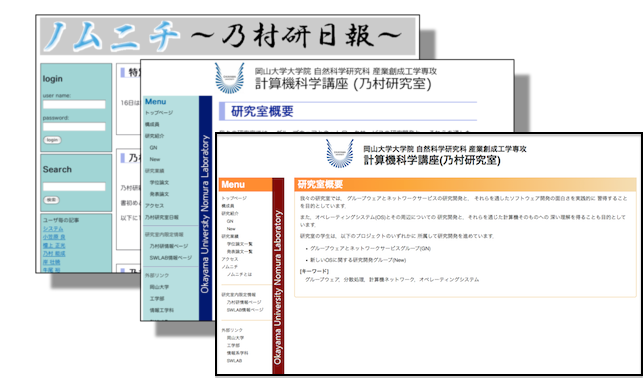
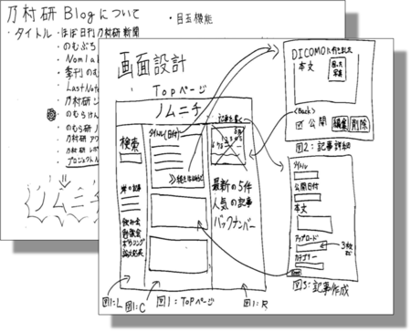

+++
showDate = false
draft = false
title = 'ノムニチとは'
+++

乃村研日報(通称ノムニチ)は，研究室全員(もちまわり)で書いているブログです．
研究室の雰囲気が少しは伝わればと思っています．

このブログシステムは，
2008年7月に Web プログラミング (Rails) 勉強会において，
先生を含む研究室全員が作成した
文字通り，みんなでゼロから作ったブログになっています．

その後，CMSもどきへの拡張を行った後，2012年4月 Haskell の勉強会において，
Yesodで動作するコードへ書き直しました．

更に 2015年9月，Ruby on Rails にて再び生まれ変わりました．
現在の乃村研のページは，このシステムで運用されています．

        
