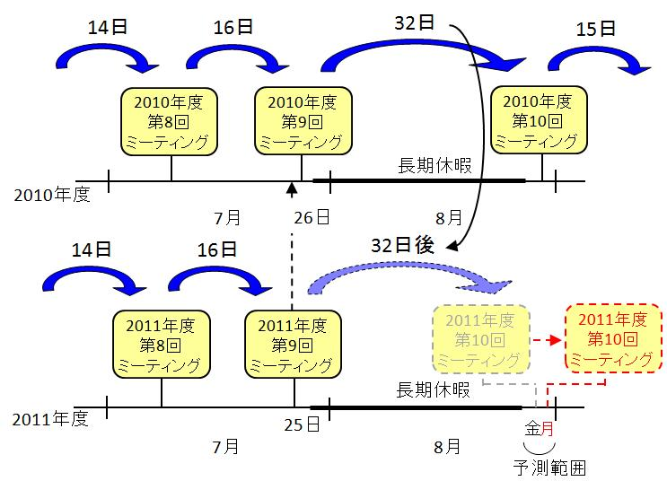
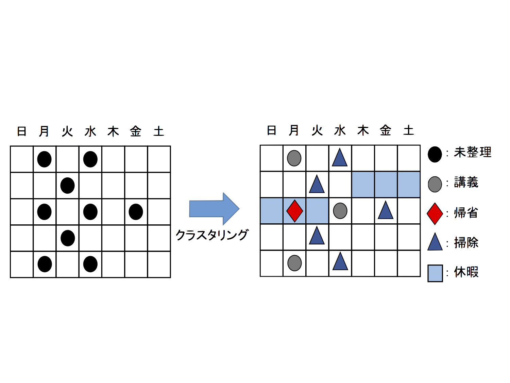
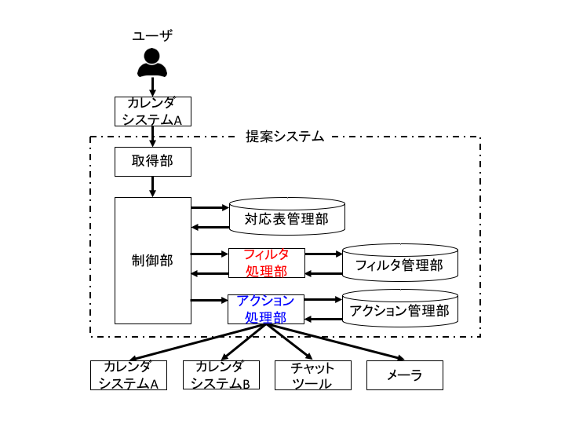
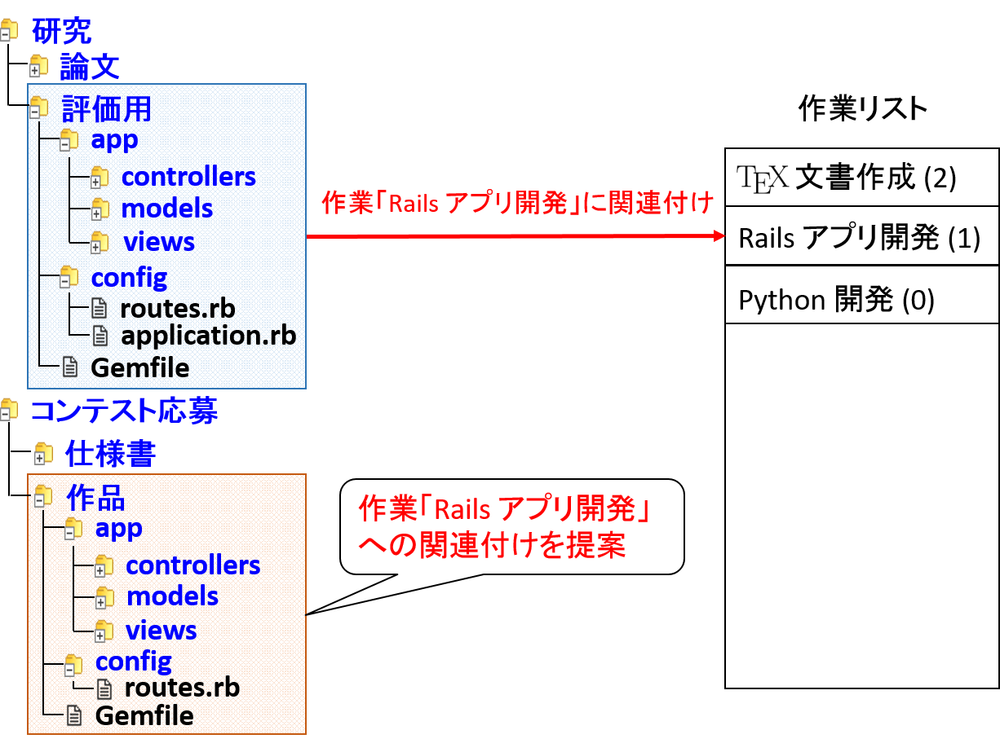
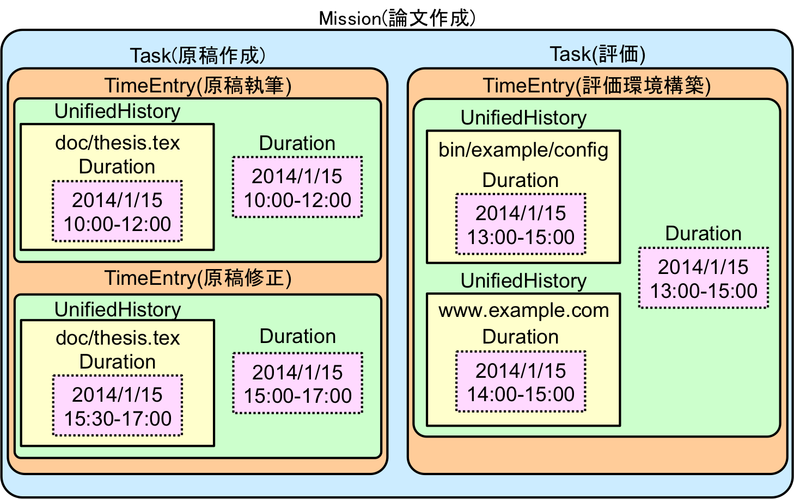
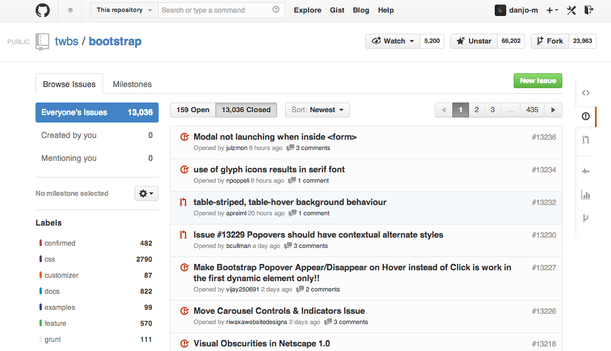

+++
showDate = false
draft = false
title = 'GN (グループウェアとネットワークサービス)'
+++

本グループでは，
コンピュータとネットワークを利用したグループ作業の支援について研究しています．
グループ作業の効率化を図るシステムを開発し，ネットワークを通じて Loose Coupling しつつ互いに連携するシステム構成法について研究しています．
過去の卒論・修論・対外発表のテーマ一覧(一部)を以下に掲載します．

## 作業の発生パターンを用いた作業予測

我々が将来の予定について計画するとき，過去の作業履歴を参考にすることが多いです．
これは，多くの作業はある程度決まった周期性に基づいて発生しているからです．
たとえば，ミーティングは，「約2週間に1回」といった曖昧な周期をもちます．
ここで注意しておきたいことは，作業は単純な一定の周期ではなく，曖昧な周期性をもっている点です．
作業が曖昧な周期性をもつ理由は，作業の発生には様々な要因が影響しているからです．
たとえば，ミーティングは，「会議参加者の都合に左右される」，「長期休暇には行われない」といった特徴があります．
このため，ミーティングには「会議参加者の都合」，「長期休暇」といった要因が影響していると考えられます．
このように，作業には曖昧な周期性があり，作業の発生を決定づける何らかの規則があるといえます．
この規則から作業の発生を確認できれば，将来の作業予測や仕事の引き継ぎ時の情報伝搬に有用だと考えられます．
本研究では，この規則を作業の発生パターンと呼びます．
作業発生パターンを機械学習や波の解析によって検出することで作業予測を行います．

【特徴】
 - 将来の作業予測
 - 曖昧な周期をもつ作業を表現するモデルの提案
 - 周期性の継承に基づく作業予測手法

【リンク】
- [スライド](kitagaki-slide.pdf)

## カレンダの予定をクラスタリングする手法の検討
日々発生する予定は，カレンダを用いて管理することが多いです． これらの予定について，その特徴に基づいて， 類似している予定を集合として整理しておくことは計画立案において有用です． そこで，本研究では，予定の整理を支援する方法として， 類似している予定をグループにまとめる手法を検討しています． これは，着目した特徴に基づいてデータをグルーピングする手法であるクラスタリング をおこなうことに相当します． 具体的には，予定間に存在する周期性に着目したクラスタリング手法を提案します．

【特徴】
- 周期の信頼性を特徴としたクラスタリング手法
- 階層型クラスタリングを応用した手法の提案
- 階層の親子関係を利用したクラスタ名の自動生成

【リンク】
- [スライド](ishikawa-slide.pdf)

## カレンダシステムにおける予定共有を支援する手法の提案
自分の予定だけでなく，他者の予定を管理するための手段として，予定共有があります．予定共有を行うことで，他者の行動を把握でき，無駄な作業を削減できます．しかし，複数人で予定共有を行う場合，自分が所持するすべての予定の共有状況を把握するのは困難です．そこで，予定管理と予定共有を行うシステムとして，カレンダシステムがあります．カレンダシステムを利用することで，複数のカレンダの管理や，複数人での予定共有が簡単に行えます．しかし，既存のカレンダシステムにおける予定共有には，2つの問題があります．1つ目の問題は，予定の見せ方を自由に変更できないことです．2つ目の問題は，複数の予定の共有先が同一システム間に限定されることです．そこで，本研究では，これらの問題に対処するために，カレンダシステムにおける予定共有を支援する手法を提案します．

【特徴】
- 複数人でのカレンダシステムの利用を支援
- 相手に応じて予定をフィルタリングする機能
- 様々なアプリケーションに予定を共有する機能

【リンク】
- [スライド](yamamoto-e-slide.pdf)

## 同様の作業におけるフォルダ構造の類似性に着目したファイル整理支援手法の提案
我々は，以前と同様の作業を行う際，前回の作業内容の確認とファイルの再利用を目的に過去のファイルを利用することがよくあります．このとき，過去に行った同様の作業のファイルが何らかの形で管理されていれば，作業を行う際に過去のファイルを探す手間を削減できます．また，フォルダの中にはユーザが行った作業を代表するフォルダが存在し，これをワーキングディレクトリと呼びます．本研究では，同様の作業におけるフォルダ構造の類似性に基づきフォルダを作業に関してクラスタリングすることで，ワーキングディレクトリと作業の関連付けによる整理の手間を軽減します．

【特徴】
- 階層構造の形状とファイル種別によるフォルダ間距離の算出
- 同様の作業におけるフォルダ構造の類似性に基づくフォルダのクラスタリング

【リンク】
- [スライド](nishi-slide.pdf)

## 計算機上の仕事状態の保存と復元機能（デスクトップブックマーク）
私達が仕事で利用するアプリケーションの多くは，
仕事の再開を支援するために
「最近開いたファイル」などの履歴情報を提供しています．
同様に Web ブラウザは，「最近開いた Web ページ」を教えてくれます．

そこで，
これらの履歴情報を収集して統一的に管理することができれば，
自分が過去に参照したデータを効率的に想起できると考えられます．

本研究では，この履歴情報を管理するアプリケーションとして，
「デスクトップブックマーク」を設計・実装しています．
デスクトップブックマークは，
統一的な履歴情報を自動で収集して管理する機能を持っています．

既存ツールに比べた特徴として，
履歴情報の集合を具体的な作業や仕事の単位で集約できる点があります．
この特徴によって，ある時点のデスクトップの状態を栞のように複数保存でき，
作業状態の保存や復元を容易にしています．
また，作業や仕事の単位でまとめられた履歴情報を利用し，
容易に作業や仕事を引き継げます．

【特徴】
- 複数の作業状態を保存可能
- 任意の時点で作業状態を保存可能
- 計算機環境は，常に最新を保つ
- 仕事単位，作業単位で履歴情報を提示可能
- 履歴情報を仕事の引継ぎに利用可能

【リンク】
- [スライド](okada-slide.pdf)

## ソーシャルコーディングにおける有益提案の抽出
ソフトウェア開発では，ソーシャルコーディングと呼ばれる手法が広がりつつあります．
ソーシャルコーディングでは，プロジェクトのソースコードは公開され，
世界中からソースコードの改善に関する提案が寄せられます．
このような提案を積極的に取り入れることは，コミュニティの活性化につながります．
しかし，提案によって内容の良し悪しが大きく異なるため，
有益そうな提案から優先的に内容を吟味したいという要求があります．
また，コミュニティの活性化のためには，ユーザを分け隔てなく扱い，
初めてプロジェクトに参加するようなユーザの提案も多く取り入れる必要があります．
そこで本研究では，ソーシャルコーディングサービスであるGitHubを対象として，
ユーザの行動を学習し，有益な提案を抽出する方法について研究しています．

【特徴】
- GitHub上のデータから提案の有益さを算出
- 管理者の利用しやすい方法で有益な提案を提示

【リンク】
- [スライド](emi-slide.pdf)

