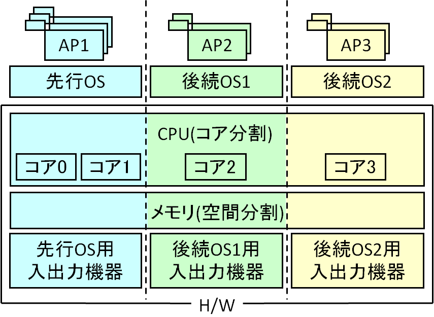
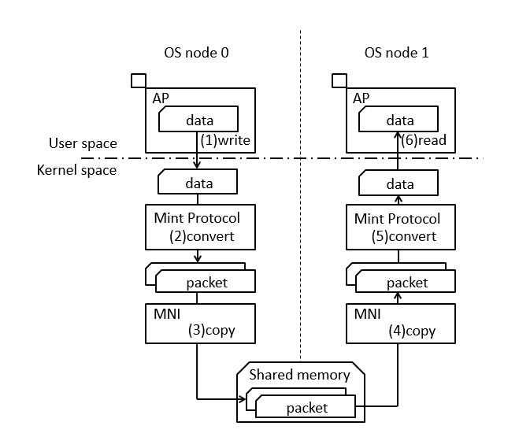
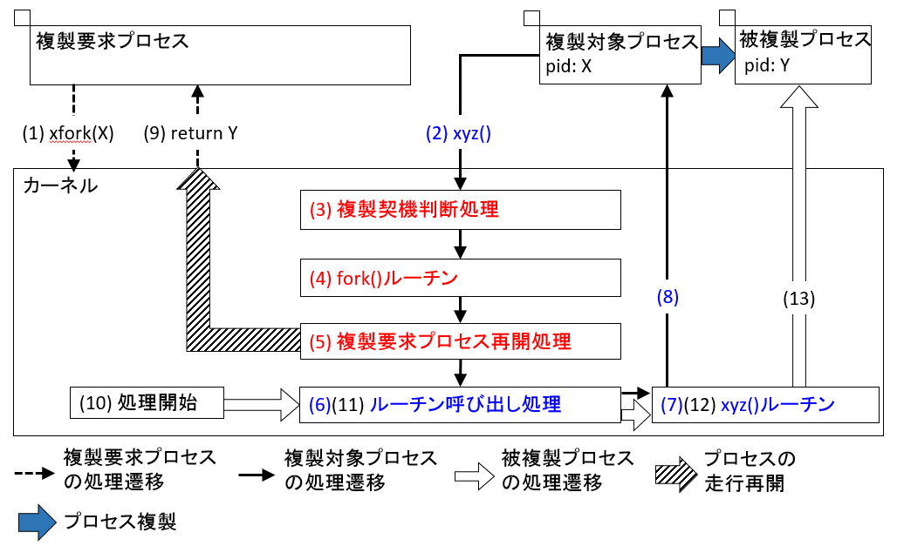
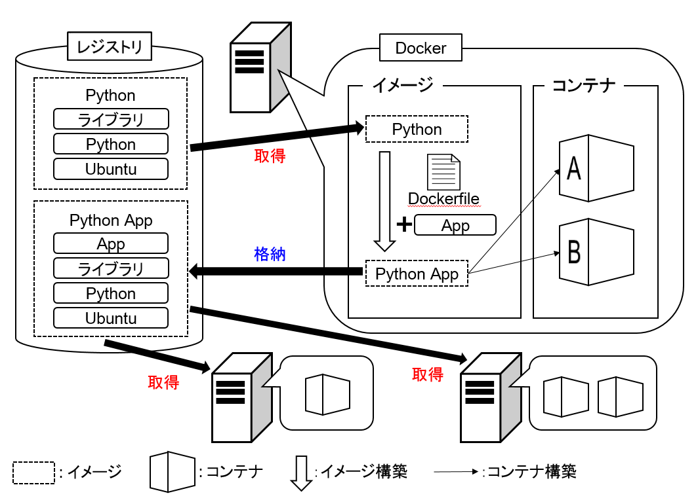

+++
showDate = false
draft = false
title = 'New (Linuxを軸としたOS/ネットワークの研究)'
+++

本グループでは，Linuxを軸としたOSやネットワークについて，
谷口研究室と合同で研究開発を進めています．
過去の卒論・修論のテーマ一覧(一部)を以下に掲載します．

## Mint: 複数のLinux を同時走行させる技術の研究
Mintは，1台の計算機上で複数のLinuxを動作させる方式です．
各OSは，計算機のハードウェアを各OSで分割し，占有することで，
高い独立性を実現しています．
特に，プロセッサに関しては，1つ以上のコアを各Linuxに占有させるため，
実計算機に近い形態での走行環境の構築が期待できます．

【特徴】
 - VM方式と違いハードウェアを仮想化しないため高速に動作
  - プロセッサ：コア分割し，各OSで占有</li>
  - メモリ：空間分割して，各OSが占有</li>
  - 入出力機器：各OS毎に占有する機器を限定</li>
 - 各OSは独立に走行
【Mintに関する研究】
  - MintにおけるLinuxとAndroidの共存制御
    - 1台の計算機上で，LinuxとAndroidを独立に走行
  - Mintにおけるコア管理機能の実現
    - Mintにおける計算機管理部の実現と動的な計算機資源の移譲
  - 実メモリ移譲機能
    - 各OSの実メモリ使用量の変動に基づいて実メモリを動的再分配
    - Mintにおけるデバイス移譲方式
    - 割り込みルーティングの変更によるデバイス移譲
  - Mint上のKVMの評価
    - MintへのVM方式の導入
    - Mintを用いた割り込み処理のデバッグ支援環境
    - 仮想化の処理負荷の影響を受けない状態での割り込み処理のデバッグ
    - MintにおけるOS起動の高速化手法の実現
    - ディスクI/Oの最小化によるOS起動の高速化

## Mintにおける仮想ネットワークインタフェースによるOSノード間通信の実現
Mintでは，NICハードウェアを用いることで，
OSノード間で相互に通信可能です．この通信手法では，OSノード間で
各OSノードにNICハードウェアを占有させる必要があります．
Mint上で同時に走行可能なOSは，CPUの増加に伴い増加しているため，
用意するNICハードウェアの数も増やす必要があります．
しかし，1台の計算機に搭載可能なNICハードウェアの数には限界があるため，
すべてのOSノードにNICハードウェアを占有させることはできません．
このため，OSノード間で通信できるOSノードの数に限界があります．
そこで，本研究では，MintにおけるOSノード間通信をLinux互換で実現します．
具体的には，共有メモリを介した通信をEthernet互換で行う仮想ネットワークインタフェース
とするデバイスドライバとして実現します．

【リンク】
- [スライド](ogura-i-slide.pdf)

## 走行中のプロセスを他プロセスから複製する手法の実現
  UNIXオペレーティングシステムでは，走行中のプロセスを複製することで新
たなプロセスが生成されます．プロセスの複製はfork()システムコールによって
行われる．また，fork()システムコールは自プロセスしか複製できない．この
ため，UNIXオペレーティングシステムでは，他プロセスから走行中のプロセス
を複製できません．したがって，走行中のプロセスを複製したい場合，そのプロ
セス自身がfork()システムコールを発行するようにプログラムを改変しなけれ
ばなりません．しかし，他プロセスから走行中のプロセスを複製できれば，この
ような改変は不要です．
そこで，本研究では，走行中のプロセスを他プロセスから複製する手法を実
現しました．

【リンク】
- [スライド](suzuki-slide.pdf)

## Dockerにおけるコンテナによるネットワーク構築支援
アプリケーション実行環境構築にDockerを用いる手法が普及しています．
Dockerを用いてソフトウェアサービスの構築を行う場合，
サービスの機能単位でコンテナを構築します．そして，これらのコンテナを連携して
1つのサービス環境を構築します．このような環境構築には，機能拡張の容易性や
サービス構成の柔軟性といったメリットがあります．その一方で，コンテナ間の
通信オーバヘッドにより，サービスの処理性能低下が問題となります．つまり，
複数コンテナによるサービス構成の柔軟性とそれに伴うコンテナ間の通信オーバヘッドは，
トレードオフの関係にあります．このため，コンテナの粒度と配置を
適切に検討する必要があります．そこで，本研究では，コンテナの粒度と配置を検討し，
クラウドシステムの高性能化と管理の効率化を実現します．

【リンク】
- [スライド](hashimoto-slide.pdf)
