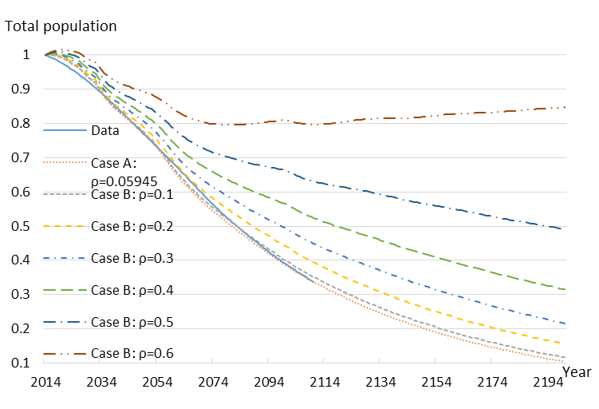

+++
showDate = false
draft = false
title = 'その他'
+++

## 人口内生化世代重複モデルによる公共政策の厚生分析 (経済学部と共同)

本研究は，岡山大学経済学部の岡本章教授と共同で取り組んでいます．
科研費 研究課題番号：[23530370](https://kaken.nii.ac.jp/d/p/23530370.ja.html) [15K03514](https://kaken.nii.ac.jp/d/p/15K03514.ja.html)

日本政府は，2014年6月に経済財政運営の基本方針「骨太の方針」において「50年後にも1億人程度の安定的な人口構造を保持する」ことを目指すという人口目標を掲げました．政府が具体的な人口目標を表明するのは初めてのことであり，ついに政府が少子化対策に本腰を入れ始めたと言えます．本研究課題の目的は，将来の人口動態が内生的に決まるように拡張されたシミュレーション・モデルを用いて，わが国が直面するこのような喫緊の最重要課題の一つに対して具体的な政策提言を行うことにあります．

本研究室では，シミュレーション分析のためのプログラム開発を担当しています．計算速度の高速化を図るために，効率的な収束計算アルゴリズムや並列計算手法について岡本章教授と共同で取り組んでいます．

【構成員】
- [岡山大学経済学部 岡本章 教授](http://www.cc.okayama-u.ac.jp/~okamot-a/okamoto.html)  (研究代表者)
- 乃村能成 准教授（研究分担者）
- [西良太](/lab/nom/users/nishi) 乃村研 M1 (ソフトウェア開発)
- [江見圭祐](/lab/nom/users/emi) 乃村研 2017年度修了 (ソフトウェア開発)
- [北垣千拡](/lab/nom/users/kitagaki) 乃村研 2015年度修了（ソフトウェア開発）