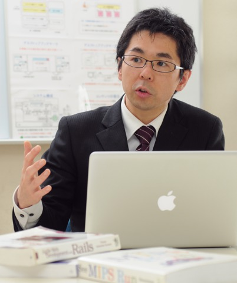

+++
title = '乃村 能成 (Yoshinari Nomura)'
date =  '2026-09-29T00:00:00+09:00'
+++

<a href="./index-j.html"> Japanese&raquo;</a>

<dl>
  <dt> Associate Professor</dt>

  <dt> Qualifications : </dt>
  <dd> Ph.D. </dd>

  <dt>Member of : </dt>
  <dd> IPSJ, IEICE</dd>

  <dt>Address : </dt>
  <dd> Dept. of Information Technology, Faculty of Engineering,
    Okayama University.
    Tsushimanaka 3-1-1, Okayama 700-8530, JAPAN
    

      Phone: +81-86-251-8186 
      Fax:  +81-86-251-8256 
      Mail:  nom  (at)  cs.okayama-u.ac.jp
    

  </dd>
</dl>
